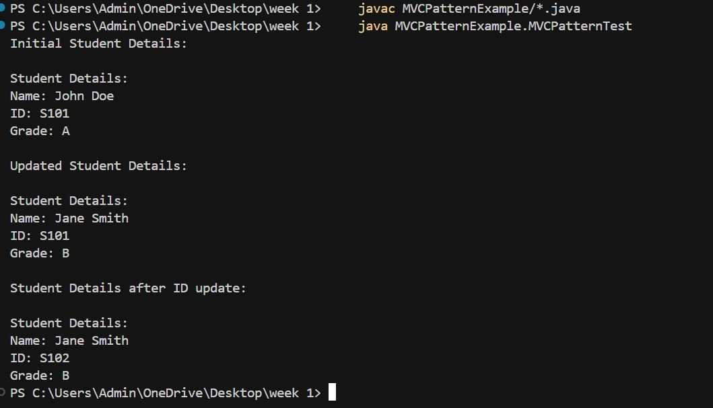

# MVC Pattern Example

This folder contains an example implementation of the Model-View-Controller (MVC) architectural pattern in Java.

## Files:

- `Student.java`: Represents the Model, which holds the data (student name and roll number).
- `StudentView.java`: Represents the View, which displays the student information to the user.
- `StudentController.java`: Represents the Controller, which handles user input, updates the Model, and updates the View.
- `MVCPatternTest.java`: The main class that demonstrates the MVC pattern by creating a Model, View, and Controller, and then manipulating the student data.

## How to Run

1. Compile the Java files:
```bash
javac Student.java StudentView.java StudentController.java MVCPatternTest.java
```
2. Run the main class:
```bash
java MVCPatternTest
```

<<<<<<< HEAD
=======
## Output

 
>>>>>>> 0a723bc (Initial commit for Week 1)
